<div align="center">



<br/>


<br/><br/>

<a href="https://richiedatalyst.github.io/">

</a>
<a href="https://linkedin.com/in/ameer-abdullah">

</a>
<a href="mailto:abdullahameer255@gmail.com">

</a>
<a href="https://github.com/RichieDatalyst">

</a>

</div>

---

## About

```
name       : Ameer Abdullah
role       : Data Scientist & AI Engineer
university : FAST NUCES, Lahore
degree     : B.S. Data Science  (2021 – 2025)
status     : Open to opportunities

specialties:
  - Multi-agent LLM systems  (LangGraph, LangChain)
  - RAG pipelines & vector search  (FAISS)
  - Explainable AI  (SHAP, LIME)
  - NLP & Generative AI  (Gemini, Groq, Cohere)
  - MLOps & CI/CD  (MLflow, GitHub Actions)

numbers_that_matter:
  projects_shipped : 3  — all with live YouTube demos
  model_accuracy   : 97%
  training_steps   : 4.5 million
  test_pass_rate   : 100%
```

---

## Featured Projects

<table>
<tr>

<td width="33%" valign="top" align="center">

**PetNutriCare**

*Final Year Project — 2025*

AI-powered nutrition system for pets and farm animals. Uses NLP to extract health insights from unstructured veterinary records. Gemini API chatbot with SHAP and LIME explainability for every recommendation. 100% test pass rate, 0% defect density across 10 modules.

<br/>

<a href="https://www.youtube.com/watch?v=GWZsPSjmgyg">

</a>
<a href="https://github.com/RichieDatalyst/PetNutriCare-FYP-Video-Demo">

</a>

<br/><br/>


</td>

<td width="33%" valign="top" align="center">

**ScholarGraph**

*Research Tool — 2024*

Autonomous multi-agent LLM system using LangGraph. Reads and analyzes scientific papers at Beginner, Intermediate, and Expert levels. Built-in hallucination detector, multi-dimensional quality scoring, conversational RAG chatbot. Intelligent fallback routing across 4+ LLM providers.

<br/>

<a href="https://www.youtube.com/watch?v=0JbsiVpIXmk">

</a>
<a href="https://github.com/RichieDatalyst/ScholarGraph">

</a>

<br/><br/>


</td>

<td width="33%" valign="top" align="center">

**Neuro Sentinel Snake**

*ML Research — 2024*

End-to-end ML system auditing AI pathfinding agents. Six models trained on 4.5 million game steps achieving 97% action prediction accuracy. SHAP explainability detected a 39% performance drift in A* — the kind of silent failure that breaks production models. Full MLflow tracking and GitHub Actions CI/CD.

<br/>

<a href="https://www.youtube.com/watch?v=XKWMQ6UCb3Q">

</a>
<a href="https://github.com/RichieDatalyst/Neuro-Sentinel-Snake">

</a>

<br/><br/>


</td>

</tr>
</table>

---

## Tech Stack

**Languages**


**AI and Machine Learning**


**Frameworks and Tools**


**Data**


**DevOps**


<br/>

<p align="center">

&nbsp;

&nbsp;

&nbsp;

&nbsp;

&nbsp;

&nbsp;

&nbsp;

&nbsp;

&nbsp;

&nbsp;

</p>

---

## GitHub Stats

<div align="center">


&nbsp;&nbsp;


</div>

<div align="center">


</div>

---

## Trophies

<div align="center">

</div>

---

## Contribution Activity


---

## Contribution Snake

<div align="center">
<picture>
  <source media="(prefers-color-scheme: dark)"  srcset="https://raw.githubusercontent.com/RichieDatalyst/RichieDatalyst/output/github-contribution-grid-snake-dark.svg"/>
  <source media="(prefers-color-scheme: light)" srcset="https://raw.githubusercontent.com/RichieDatalyst/RichieDatalyst/output/github-contribution-grid-snake.svg"/>
  
</picture>
</div>

---

<div align="center">


<br/>

[](https://github.com/RichieDatalyst)
&nbsp;
[](https://github.com/RichieDatalyst)

</div>
